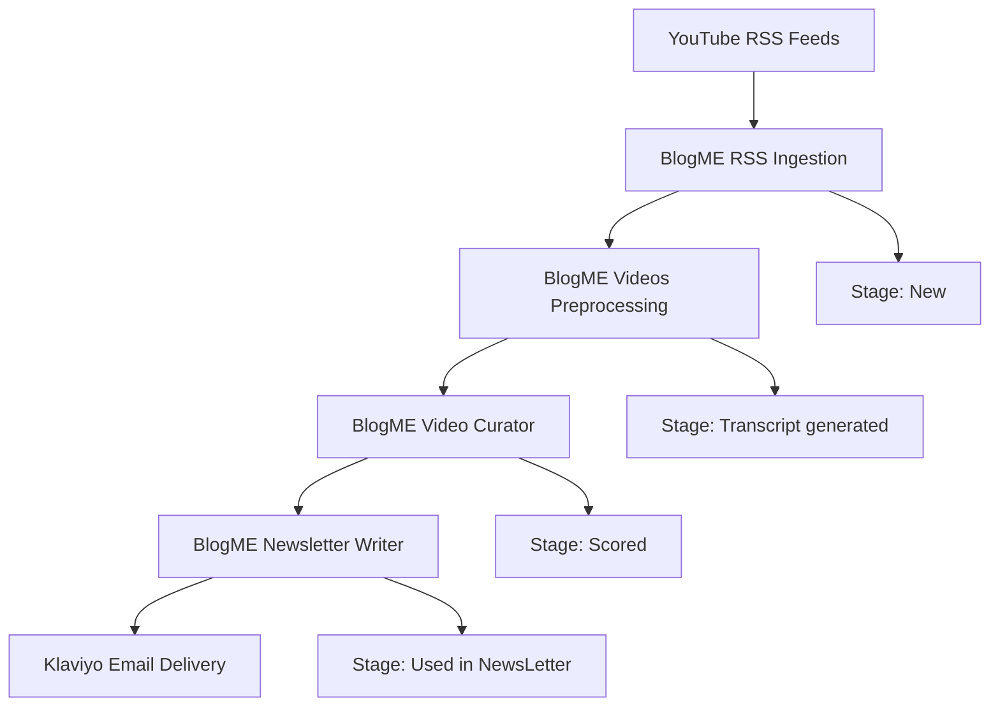

# BlogME Complete Automation System Documentation

## ⚠️ IMPORTANT: License Agreement Required

**BEFORE USING THIS SOFTWARE, YOU MUST READ AND AGREE TO THE LICENSE TERMS.**

Please carefully review the [LICENSE](LICENSE) file included in this repository. By downloading, installing, or using this software, you acknowledge that you have read, understood, and agree to be bound by all terms and conditions specified in the license agreement.

**Key License Points:**
- ✅ **Permitted:** Personal use, internal company operations, educational purposes
- ❌ **Prohibited:** Resale, redistribution, or commercial offerings without explicit written consent
- 📄 **Commercial Use:** Requires separate consultancy agreement with OpsME.ai SRL Romania
- ⚖️ **Liability:** Unauthorized resale subjects you to full legal liability

---

## 🎯 System Overview

BlogME is a comprehensive AI-powered content automation system that transforms YouTube channel monitoring into intelligent newsletter generation. The system automatically discovers, processes, scores, and distributes video content through a sophisticated 4-stage pipeline.

**Complete Pipeline:**
```
YouTube RSS Feeds → Transcript Processing → AI Scoring → Newsletter Distribution
```

**Data Lifecycle:**
```
New → Transcript generated → Scored → Used in NewsLetter
```

---

## 🏗️ System Architecture

### 4-Workflow Pipeline



### Data Flow Overview
1. **RSS Ingestion**: Discovers new videos from YouTube channels
2. **Video Preprocessing**: Extracts transcripts and generates AI summaries
3. **Video Curation**: Scores content using 5-component AI analysis
4. **Newsletter Generation**: Creates and sends branded newsletters via Klaviyo

---

## 📊 Airtable Database Schema

### Videos Table

The central database table that tracks videos through all 4 stages:

| Field Name | Type | Stage Added | Purpose |
|------------|------|-------------|---------|
| **VideoID** | Single line text (Primary) | New | YouTube video identifier |
| **Video Title** | Single line text | New | Video title from YouTube |
| **Full Video URL** | URL | New | Complete YouTube video link |
| **Channel Name** | Single line text | New | YouTube channel name |
| **Publication Date** | Date Format | New | When video was published |
| **ChannelID** | Single line text | New | YouTube channel identifier |
| **Stage** | Single select | New | Current processing stage |
| **Transcript** | Long text | Transcript generated | Full video transcript |
| **Content Summary** | Long text | Transcript generated | AI-generated summary |
| **Main Ideas** | Long text | Transcript generated | Key concepts extracted |
| **Description** | Long text | Transcript generated | YouTube video description |
| **Keywords** | Single line text | Transcript generated | Video tags/keywords |
| **VideoScore** | Number | Scored | AI-generated score (0-100) |
| **Score Breakdown** | Long text | Scored | Component score details |
| **Score Reasoning** | Long text | Scored | AI explanation |

### Sources Table 

Configuration table for YouTube channels to monitor:

| Field Name | Type | Purpose |
|------------|------|---------|
| **Source Name** | Single line text | Channel display name |
| **Website URL** | URL | YouTube channel URL |
| **Source Type** | Single select | Must be "YouTube Channel" |
| **Active** | Checkbox | Enable/disable monitoring |
| **Youtube Channel ID** | Single line text | Auto-populated channel ID |

---

## 🔄 Stage Progression System

### Stage 1: New
**Created by:** BlogME RSS Ingestion  
**Criteria:** Freshly discovered videos from YouTube RSS feeds  
**Fields Populated:**
- VideoID, Video Title, Full Video URL
- Channel Name, Publication Date, ChannelID
- Stage = "New"

### Stage 2: Transcript generated  
**Created by:** BlogME Videos Preprocessing  
**Criteria:** Successful transcript extraction and AI analysis  
**Fields Added:**
- Transcript (full video text)
- Content Summary (AI-generated)
- Main Ideas (key concepts)
- Description, Keywords
- Stage = "Transcript generated"

### Stage 3: Scored
**Created by:** BlogME Video Curator  
**Criteria:** AI scoring completed with 5-component analysis  
**Fields Added:**
- VideoScore (0-100 total score)
- Score Breakdown (component scores)
- Score Reasoning (AI explanation)
- Stage = "Scored"

### Stage 4: Used in NewsLetter
**Created by:** BlogME Newsletter Writer  
**Criteria:** Video included in newsletter and sent to subscribers  
**Purpose:** Prevents duplicate usage in future newsletters  
**Stage = "Used in NewsLetter"**

---

## 📋 Workflow 1: BlogME RSS Ingestion

### Purpose
Automatically discovers new YouTube videos from monitored channels using RSS feeds and YouTube Data API v3.

### Key Features
- **Smart Channel Resolution**: Handles @username, /channel/, and /c/ URL formats
- **Duplicate Prevention**: Sophisticated merge operations prevent reprocessing
- **YouTube API Integration**: Resolves channel identifiers to channel IDs
- **RSS Processing**: Efficient video discovery via YouTube RSS feeds

### Configuration Requirements
```yaml
YouTube Data API Key: <your_yt_api_key>
Base: <your_airtable_base_ID>
Table: <your_airtable_table_ID>
Videos Table: <your_airtable_videos_table_ID>
Schedule: Daily at 9 AM
```

### Typical Output
- 10-50 new videos per day across monitored channels
- Stage progression: None → "New"
- Duplicate prevention

---

## 📋 Workflow 2: BlogME Videos Preprocessing

### Purpose
Extracts transcripts and generates AI-powered content analysis for videos in "New" stage.

### Key Features
- **Apify Integration**: Professional transcript extraction service
- **Dual AI Analysis**: Parallel summarization and main ideas extraction
- **Robust Error Handling**: Continue processing on individual failures
- **Content Enrichment**: Adds description, keywords, and metadata

### Configuration Requirements
```yaml
Apify API Token: <your apify token>
Apify Actor: karamelo~youtube-transcripts
LangChain Agents: Summarization + Main Ideas
Processing: Sequential (rate limiting)
Retry Strategy: 8 maximum retries
```

### AI Agents Configuration
**Summarization Agent:**
- System Message: "Summarize the following youtube transcript in markdown format:"
- Output: Concise video summary

**Main Ideas Agent:**
- System Message: "Extract the main ideas from the following youtube transcript in markdown format:"
- Output: Key concepts and insights

### Typical Output
- Processing time: 30-60 seconds per video
- Stage progression: "New" → "Transcript generated"
- Success rate: 90%+ (depends on video availability)

---

## 📋 Workflow 3: BlogME Video Curator

### Purpose
Scores videos using AI-powered 5-component analysis to identify the highest-value content for newsletters.

### Key Features
- **5-Component Scoring System**: Comprehensive content evaluation
- **Claude 4 Sonnet Integration**: Advanced AI analysis
- **Structured Output**: JSON-formatted scoring with reasoning
- **Batch Processing**: Sequential processing with error isolation

### Configuration Requirements
```yaml
Model: Claude 4 Sonnet (claude-sonnet-4-20250514)
Anthropic API: Configured credentials
Time Window: Last 7 days
Input Stage: "Transcript generated"
Output Stage: "Scored"
```

### 5-Component Scoring System

#### 1. Content Relevance (40 points max)
- **Market Analysis & Trends** (0-15 points)
- **Investment Strategies** (0-15 points)  
- **Financial Analysis** (0-10 points)

#### 2. Actionability & Practical Value (25 points max)
- **Immediate Applicability** (0-15 points)
- **Learning Value** (0-10 points)

#### 3. Credibility & Authority (20 points max)
- **Source Credibility** (0-12 points)
- **Content Quality** (0-8 points)

#### 4. Timeliness & Uniqueness (15 points max)
- **Timeliness** (0-8 points)
- **Uniqueness** (0-7 points)

#### 5. Keyword Bonus (15 points max)
- **High-value keywords**: +3-5 points each
- **Medium-value keywords**: +2-3 points each
- **Standard keywords**: +1-2 points each

### Typical Output
- Score range: 0-100 points
- Processing time: 15-30 seconds per video
- Stage progression: "Transcript generated" → "Scored"
- Average scores: 40-80 points for quality content

---

## 📋 Workflow 4: BlogME Newsletter Writer

### Purpose
Automatically generates and distributes AI-powered newsletters from the highest-scored content via Klaviyo email campaigns.

### Key Features
- **Top Content Selection**: Automatically selects top 5 videos from last 7 days
- **AI Newsletter Generation**: Claude 4 Sonnet creates branded newsletters
- **Klaviyo Integration**: Complete campaign creation and email delivery
- **Dynamic Campaign Naming**: Extracts subject lines for campaign names
- **Video Tracking**: Marks used videos to prevent reuse

### Configuration Requirements
```yaml
Model: Claude 4 Sonnet (claude-sonnet-4-20250514)
Klaviyo API Keys:  <your_klavyio_api_key>
Klaviyo List ID: <your_klavyio_emailing_list_ID>
Window: Last 7 days
Content Selection: Top 5 scored videos
Schedule: Daily at 12 PM
```

### Newsletter Generation Process
1. **Content Selection**: Filter videos with Stage="Scored" from last 7 days
2. **Data Aggregation**: Combine video titles, URLs, channels, main ideas
3. **AI Generation**: Claude creates branded newsletter with structured format
4. **HTML Processing**: Minify content for Klaviyo template system
5. **Campaign Creation**: Dynamic campaign with extracted subject line
6. **Template Management**: Create CODE template with newsletter HTML
7. **Campaign Delivery**: Send via Klaviyo with immediate delivery
8. **Video Tracking**: Update processed videos to "Used in NewsLetter"

### Newsletter Structure
```html
<!-- Hidden Subject and Pre-header (extracted by regex) -->
<div style="display: none;">
    <strong>SUBJECT:</strong> [Newsletter Name] | Week [#] | [Key Theme]
    <strong>PRE-HEADER:</strong> [Compelling one-liner]
</div>

<!-- Newsletter Header -->
<div style="margin-bottom: 20px;">
    <strong>[NEWSLETTER NAME] WEEKLY</strong> | [Date]
    <strong>Quick Recap:</strong> [2-3 main themes]
</div>

<!-- Video Content Cards (5 videos) -->
<div style="margin-bottom: 15px;">
    <strong>[Catchphrase]</strong> • [Key insight] → <a href="[URL]">link</a>
</div>

<!-- Call to Action -->
<div style="border-top: 2px solid #333; padding-top: 15px;">
    <strong>CTA:</strong> [Relevant call-to-action]
</div>
```

### Typical Output
- Newsletter frequency: Daily (if sufficient scored content)
- Content selection: Top 5 videos automatically selected
- Stage progression: "Scored" → "Used in NewsLetter"
- Delivery success rate: 99%+ with correct API configuration

---

## 🔧 Installation & Setup Guide

### Prerequisites
- n8n installation (self-hosted or cloud)
- Airtable account with proper base structure
- YouTube Data API v3 access
- Apify account for transcript extraction
- Anthropic API access (Claude 4 Sonnet)
- Klaviyo account for email delivery

### Step 1: Airtable Setup
1. Create new Airtable base
2. Create Sources table schema
3. Create Videos table schema
4. Add YouTube channels to Sources table
5. Set Active checkbox for channels to monitor

### Step 2: API Configuration
1. **YouTube Data API v3:**
   - Enable API in Google Cloud Console
   - Generate API key with YouTube Data API v3 access
   - Set quotas and restrictions as needed

2. **Apify API:**
   - Create Apify account
   - Generate API token
   - Verify access to `karamelo~youtube-transcripts` actor

3. **Anthropic API:**
   - Create Anthropic account
   - Generate API key with Claude 4 Sonnet access
   - Configure rate limits appropriately

4. **Klaviyo API:**
   - Create Klaviyo account
   - Generate private API keys with required scopes
   - Set up subscriber list for newsletter delivery

### Step 3: n8n Workflow Import
1. Import BlogME-ingest-rss.json
2. Import BlogME-videos-preprocess.json
3. Import BlogME-video-curator.json
4. Import BlogME-newsletter-writer.json

### Step 4: Credential Configuration
Configure n8n credentials for each service:
- Airtable Personal Access Token
- YouTube Data API key
- Apify API token
- Anthropic API key
- Klaviyo API keys

### Step 5: Workflow Testing
1. **Test RSS Ingestion:** Run manually to verify channel discovery
2. **Test Video Preprocessing:** Process a few test videos
3. **Test Video Curation:** Verify scoring system works
4. **Test Newsletter Writer:** Send test newsletter to small list

### Step 6: Schedule Configuration
- RSS Ingestion: Daily at 9 AM
- Video Preprocessing: Daily at 10 AM
- Video Curation: Daily at 11 AM
- Newsletter Writer: Daily at 12 PM
OR:
Create webhooks so that each workflow calls the next one right after they finish

---

## 🔄 Workflow Interconnections

### Data Dependencies
```
Sources Table (Active=1) → RSS Ingestion → Videos Table (Stage=New)
Videos Table (Stage=New) → Video Preprocessing → Videos Table (Stage=Transcript generated)
Videos Table (Stage=Transcript generated) → Video Curator → Videos Table (Stage=Scored)
Videos Table (Stage=Scored) → Newsletter Writer → Videos Table (Stage=Used in NewsLetter)
```

### Timing Coordination
- **9 AM**: RSS Ingestion discovers new videos
- **10 AM**: Video Preprocessing (manual trigger after ingestion)
- **11 AM**: Video Curator scores processed videos
- **12 PM**: Newsletter Writer creates and sends newsletter

### Error Handling Strategy
- **Continue on Error**: Individual failures don't stop batch processing
- **Error Isolation**: Failed videos are skipped, successful ones continue
- **Retry Logic**: Automatic retries for transient API failures
- **Manual Recovery**: Failed videos remain in previous stage for reprocessing

---

## 💰 Cost Analysis & ROI

### See @BlogME-cost-analysis 

---

## 🚨 Troubleshooting Guide

### Common Issues & Solutions

#### RSS Ingestion Issues
**Problem:** Channel ID resolution fails  
**Solution:** Verify YouTube URL format, check API key quotas
**Prevention:** Use standard YouTube channel URLs

**Problem:** Merge operation data access errors  
**Solution:** Use `.first()` method instead of `.item` after merge nodes
**Example:** `{{ $('Set ChannelID var').first().json.channelId }}`

#### Video Preprocessing Issues
**Problem:** Transcript extraction fails  
**Solution:** Check video availability, verify Apify API access
**Prevention:** Filter public videos only

**Problem:** AI analysis timeouts  
**Solution:** Monitor transcript length, implement retry logic
**Prevention:** Set reasonable timeout limits

#### Video Curation Issues
**Problem:** Inconsistent scoring  
**Solution:** Review and refine AI prompts for scoring criteria
**Prevention:** Regular prompt optimization and testing

**Problem:** No videos in scoring window  
**Solution:** Adjust time window or check preprocessing completion
**Prevention:** Monitor pipeline timing and dependencies

#### Newsletter Writer Issues
**Problem:** Klaviyo API errors  
**Solution:** Verify correct payload structure for campaign send jobs
**Critical Fix:** Use `{"data": {"type": "campaign-send-job", "id": "CAMPAIGN_ID"}}`

**Problem:** Dynamic campaign naming fails  
**Solution:** Verify regex pattern matches SUBJECT format in newsletter HTML
**Pattern:** `{{ $json.minified_html.match(/SUBJECT:<\/strong> ([^<]+)</)[1] }}`

### Emergency Procedures
1. **System Down:** Check API service status for all integrations
2. **Data Corruption:** Restore from Airtable revision history
3. **Newsletter Issues:** Send manual newsletter while fixing automation
4. **High Costs:** Review API usage patterns and implement rate limiting

---

## 🚀 Advanced Configuration & Customization

### Content Customization
- **Scoring Criteria:** Adjust component weights based on audience needs
- **Newsletter Templates:** Create multiple branded templates for different audiences
- **Content Filters:** Add custom filtering logic for specific content types
- **Time Windows:** Adjust processing windows based on content velocity

### Performance Optimization
- **Parallel Processing:** Enable concurrent transcript extraction where possible
- **Intelligent Caching:** Cache frequently accessed data to reduce API calls
- **Smart Batching:** Optimize batch sizes based on content volume
- **Progressive Processing:** Overlap processing stages for better throughput

### Integration Extensions
- **Multi-Channel Distribution:** Add SMS, social media, and web publishing
- **Analytics Integration:** Connect Google Analytics for detailed performance tracking
- **CRM Synchronization:** Sync subscriber data with CRM systems
- **Feedback Loops:** Incorporate subscriber engagement data into content scoring

---

## 🔒 Security & Compliance

### Data Security
- **API Key Management:** Store all keys securely in n8n credentials system
- **Access Control:** Implement proper user permissions and role-based access
- **Data Encryption:** Ensure all data transmission is encrypted (HTTPS/TLS)
- **Audit Logging:** Maintain detailed logs of all system activities

### Privacy Compliance
- **Content Source Attribution:** Maintain clear records of content sources
- **Subscriber Consent:** Ensure proper opt-in procedures for newsletter subscribers
- **Data Retention:** Implement appropriate data retention and deletion policies
- **Terms Compliance:** Adhere to all platform Terms of Service (YouTube, Klaviyo, etc.)

### Backup & Recovery
- **Airtable Backups:** Regular exports of database content
- **Workflow Backups:** Version control for n8n workflow configurations
- **Configuration Documentation:** Maintain current setup documentation
- **Disaster Recovery:** Procedures for rapid system restoration

---

## 📞 Support & Maintenance

### Contact
**help@opsme.ai**

### Regular Maintenance Tasks
- **Weekly:** Review processing logs and error rates
- **Monthly:** Optimize AI prompts and scoring criteria
- **Quarterly:** Update API keys and review security configurations
- **Annually:** Comprehensive system audit and optimization

### Performance Monitoring
- **API Health:** Monitor all external service availability
- **Processing Metrics:** Track throughput, success rates, and error patterns
- **Cost Monitoring:** Regular review of API usage and associated costs
- **Content Quality:** Ongoing validation of AI-generated content

### System Updates
- **n8n Updates:** Keep n8n platform current with latest features
- **Workflow Optimization:** Regularly review and improve workflow efficiency
- **API Changes:** Monitor for changes to external API specifications
- **Feature Enhancements:** Implement new capabilities based on user feedback

---

## 🎯 Success Metrics & KPIs

### Content Quality Metrics
- **Relevance Score:** Average video scores (target: 60+ points)
- **Content Diversity:** Number of different channels contributing content
- **Processing Accuracy:** Percentage of correctly processed videos
- **Newsletter Quality:** Subscriber engagement rates

### Operational Metrics
- **System Uptime:** Workflow execution success rate (target: 99%+)
- **Processing Speed:** Average time from video discovery to newsletter inclusion
- **Cost Efficiency:** Cost per processed video and newsletter
- **Error Rate:** Failed processing attempts (target: <5%)

### Business Impact Metrics
- **Newsletter Growth:** Subscriber acquisition and retention rates
- **Content Velocity:** Videos processed per time period
- **Automation ROI:** Cost savings vs. manual processing
- **Time Savings:** Reduction in manual content curation effort

---

*Last Updated: January 2025*  
*System Version: BlogME v2.0*  
*Documentation Version: 2.0*

**Ready to transform your content strategy?**
**This complete system delivers enterprise-level content automation at a fraction of traditional costs, saving 95%+ of manual effort while delivering consistently high-quality newsletters to your subscribers.**
